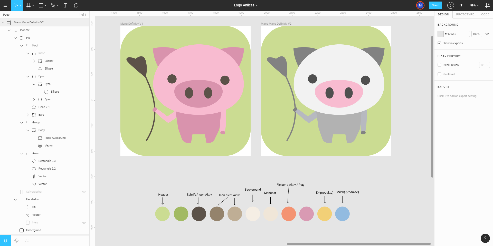
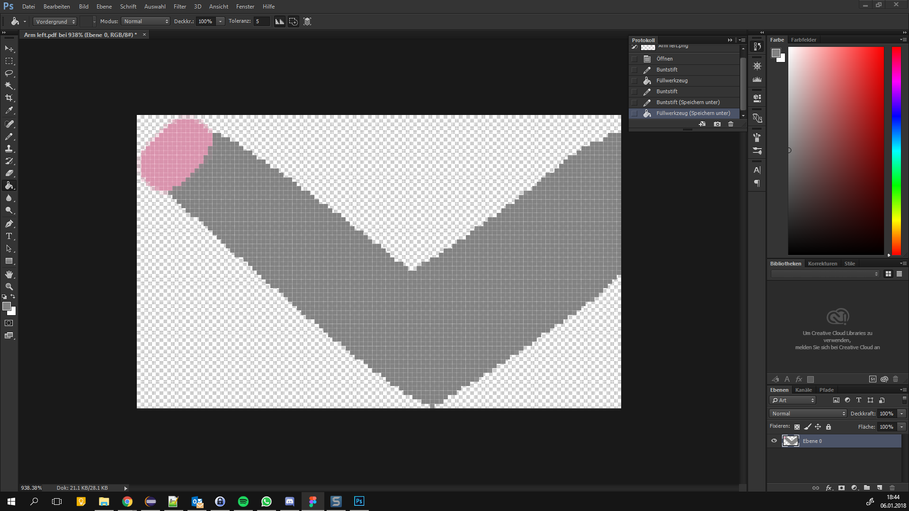

# App Design Aniless

## Idee und Ziel
Aniless ist eine mobile App, mit dessen Hilfe sich der Konsum tierischer Produkte überwachen lässt. Dazu kann der persönliche Verbrauch täglich auf einfache Weise in der App getrackt werden. 
Die Daten werden anschliessend in verschiedenen Challanges visuallisiert. Die Challanges haben das Ziel, dem Benutzer sein Konsum so vor Augen zu führen, dass er künftig möglichst auf tierische Produkte verzichten wird.  

## Screenshots

Startbildschirm

Tierverbrauch Challenge

Verbrauch Übersicht

Neues Produkt hinzufügen

