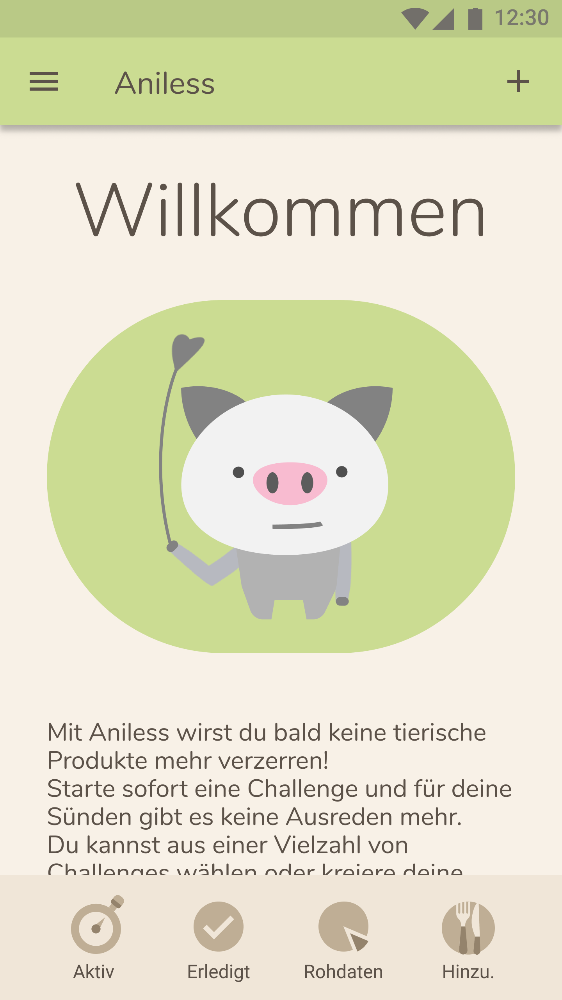
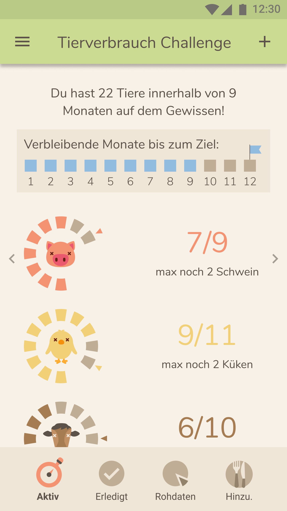
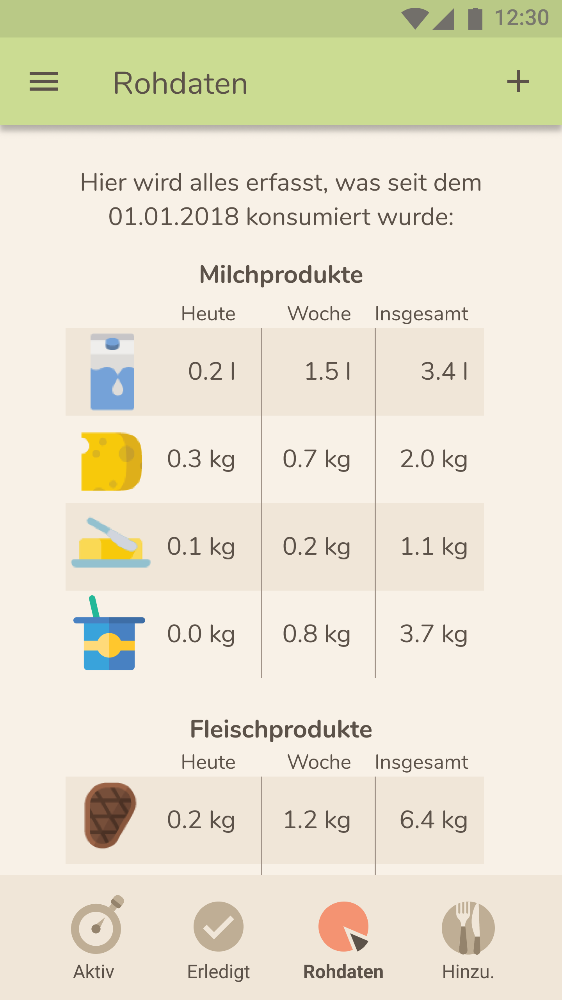
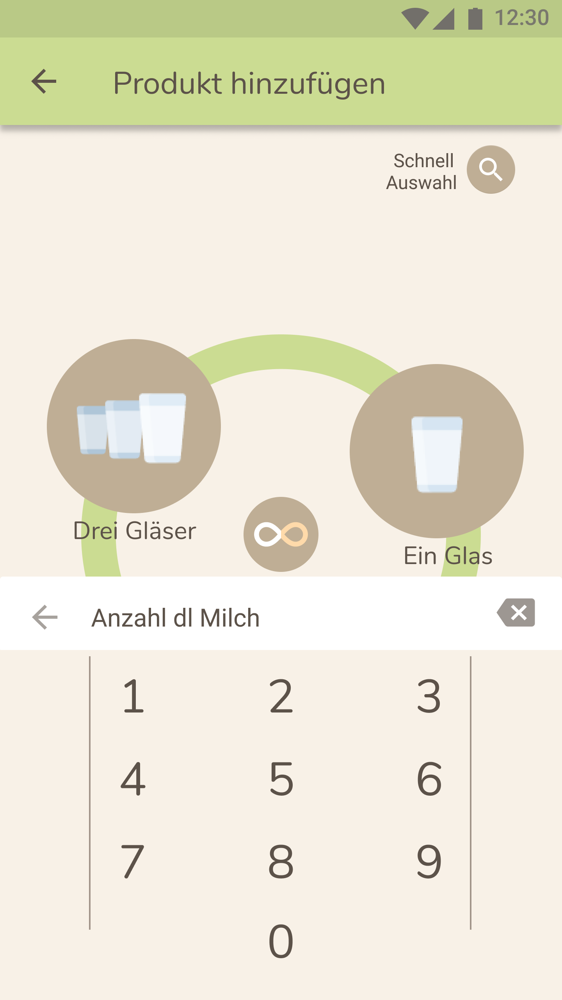

# App_Design-Aniless

## Ziel
Aniless ist eine App, mit dessen Hilfe man sein Konsum von tierischen Produkten überwachen kann. Der Verbrauch wird dazu täglich in der App dokumentiert. Die Daten werden anschliessend in verschieden wählbaren Challanges visuallisiert. Die Challanges haben das Ziel dem Benutzer vor Augen zu führen, wie hoch sein Konsum von tierischen Produkten ist und hat zum Ziel diesen künftig zu reduziern. 

## Single Screens

Begrüssung

Tierverbrauch

Übersicht Verbrauch

Neues Produkt hinzufügen

